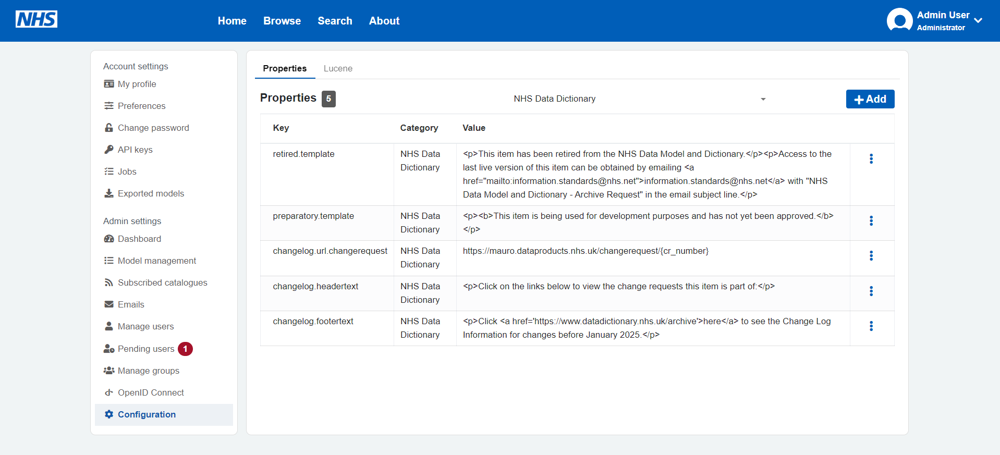
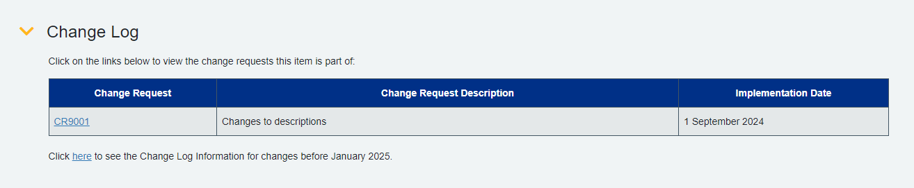

# Configuration Properties

The Data Dictionary plugin will automatically add some key API properties to Mauro. These are visible by:

1. Signing into the Mauro UI as an administrator user.
2. Click on the user menu (top right corner) and select "Configuration".
3. Under the filter, select "NHS Data Dictionary" to filter by that category. You will then see the properties available:



Some sensible default values are automatically included, however these can be changed by:

1. Clicking the triple-dot menu on each item row.
2. Select the "Edit" option.
3. Make your necessary changes and save.

## Properties

### Text

`retired.template`

The text to display for any dictionary items that are marked as retired. This text will replace the usual description entered for that item. Any valid HTML value can be used for this property value.

`preparatory.template`

The text to display for any dictionary items that are marked as preparatory. This text will replace the usual description entered for that item. Any valid HTML value can be used for this property value.

### Change Log

The following properties will affect how the change log appears on all dictionary pages, like below:



`changelog.url.changerequest`

All change entries with a Change Request reference will contain a hyperlink to the external Change Request page/document maintained by NHS England. The base URL will contain a token `{cr_number}` which will be replaced with the real CR number. For example, if this is set to:

```
https://mauro.dataproducts.nhs.uk/changerequest/{cr_number}
```

Then links will be rendered as:

```
https://mauro.dataproducts.nhs.uk/changerequest/CR9001
```

The URL must point to a valid external service that can accept the CR number provided.

`changelog.headertext`

The text to display above the change log table. Any valid HTML may be used here.

`changelog.footertext`

The text to display below the change log table. Any valid HTML may be used here. Consider including a hyperlink to an external history archive for changes that are not listed via Mauro.